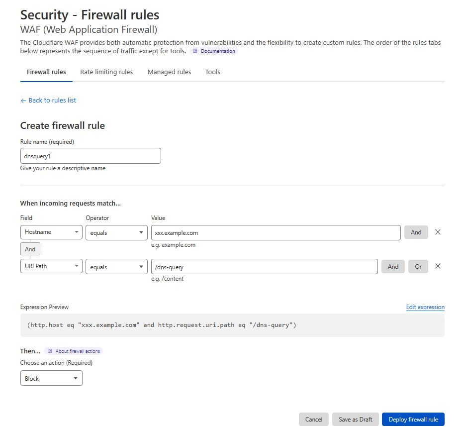
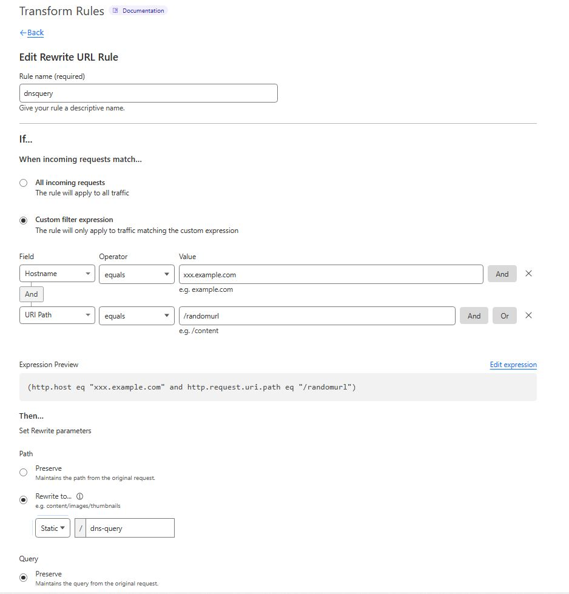

# 利用CDN中转DOH(DNS over Https)服务

常见DOH服务或加密DNS服务很容易被中断，而Firefox等浏览器则会自动切换为普通DNS服务。利用CDN中转DOH服务可以避免这一情况。


## Cloudflare设置示例

如果你已经在cloudflare上有一个叫 example.com 的域名，则需要增加一条dns记录，如: xxx.example.com

设置新增dns记录 Name: xxx.example.com , Type: CNAME , Target: dns.google

并不是所有的DOH服务都支持CDN中转，如cloudflare和nextdns的doh服务就不支持中转，需要创建worker用workers route*

保存后，用wssagent测试新的[DOH_SERVER]: xxx.example.com,  如果能获取到[WSSIP]说明CDN中转成功

在Firefox中设置新的加密DNS为： https://xxx.example.com/dns-query


## 防止DOH服务探测

避免CDN中转的DOH服务被探测到，需要改变默认的网址/dns-query , 比如我们想改成/randomurl

### * 阻止老的/dns-query被探测

Cloudflare中可选择菜单 Security -> WAF -> Create Rule -> Create firewall rule

需要设定条件 host 是刚定义的 xxx.example.com , URI Path 是 /dns-query

点击 Deploy firewall rule 保存 

保存后，用wssagent测试老的[DOH_SERVER]: https://xxx.example.com/dns-query,  如果获取[WSSIP]失败说明设置正确

如下图：




### * 用新的URI替代/dns-query

Cloudflare中可选择菜单 Rules -> Transform Rules -> Create Rule

需要设定条件 host 是刚定义的 xxx.example.com , URI Path 是我们要改成的 /randomurl 

需要设置转发到目标DOH服务器的/dns-query 网址, Rewrite to 设定为 Static, /dns-query

保存后，用wssagent测试新的[DOH_SERVER]: https://xxx.example.com/randomurl,  如果能获取到[WSSIP]说明CDN中转成功

在Firefox中设置新的加密DNS为： https://xxx.example.com/randomurl


如下图：




## 某些特定DOH服务需要用workers route

某些特定DOH服务如nextdns.io , 可能限制了hosts必须是nextdns.io, 在Cloudflare只能用workers来中转

如果你已经在cloudflare上有一个叫 example.com 的域名，则需要增加一条dns记录，如: xxx.example.com

设置新增dns记录 Name: xxx.example.com , Type: CNAME , Target: workers.dev

再新增一个workers, 假如取名为 dnsquery, 参考代码：

```
const ACCESS_URI = '/randomurl';
const DNS_URI = '/dns-query'
const DOH_SERVER = 'dns.nextdns.io';

export default {
  async fetch(request, env) {
    try {
      const parsed = new URL(request.url);
      if (parsed.pathname.startsWith(ACCESS_URI)) {
        parsed.host = DOH_SERVER;
        parsed.pathname = parsed.pathname.replace(ACCESS_URI,DNS_URI);
        let target = new Request(parsed.toString(), {
          body: request.body,
          headers: request.headers,
          method: request.method,
          redirect: request.redirect
        });
        return fetch(target);
      }
    } catch(err) {
      return new Response(err.stack, { status: 500 })
    }
  }
}
```

再在examples.com网站上增加 Workers Route

选 Workers Route -> Http Route -> Add Route

Route 填：https://xxx.example.com/randomurl ,  Service 填：dnsquery

保存后，用wssagent测试新的[DOH_SERVER]: https://xxx.example.com/randomurl,  如果能获取到[WSSIP]说明CDN中转成功

有关 Cloudflare Workers 可参照： https://github.com/httpgate/cdn-edge-script